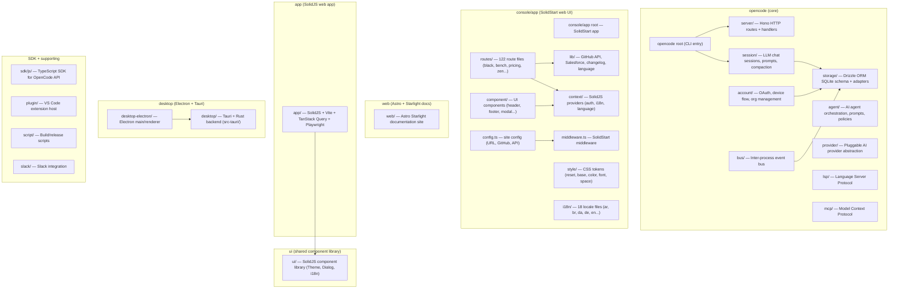

# OpenCode Repository Discovery — Master TOC

**Generated:** 2026-05-03  
**Total discovery files:** 109  
**Strategy:** Auto-coarse (bash script, not agent-based)  
**Source tree coverage:** 1,666 files across 19 packages

---

## Package Dependency Graph

---

## Series Index

### 100-series — opencode core (Effect modules)

| Doc | Path | Description |
|-----|------|-------------|
| 100-opencode-root | packages/opencode/src | Root entry + module index |
| 100-account-01 | packages/opencode/src/account/account.ts | Account module main service |
| 100-account-02 | packages/opencode/src/account/repo.ts | Account SQLite repository |
| 100-account-03 | packages/opencode/src/account/url.ts | Server URL normalization |
| 100-account-04 | packages/opencode/src/account/schema.ts | Account schemas + OAuth types |
| 100-bus | packages/opencode/src/bus | Event bus (Effect-based) |
| 100-cli | packages/opencode/src/cli | CLI entry points |
| 100-file | packages/opencode/src/file | File operations |
| 100-git | packages/opencode/src/git | Git operations |
| 100-ide | packages/opencode/src/ide | IDE integration |
| 100-installer | packages/opencode/src/installer | Installation logic |
| 100-lsp | packages/opencode/src/lsp | Language Server Protocol |
| 100-mcp | packages/opencode/src/mcp | Model Context Protocol |
| 100-provider | packages/opencode/src/provider | AI provider abstraction |
| 100-agent | packages/opencode/src/agent | Agent orchestration |
| 100-server | packages/opencode/src/server | Hono HTTP server |
| 100-snapshot | packages/opencode/src/snapshot | State snapshots |

### 150-series — opencode large modules (auto-coarse)

| Doc | Path | Files | Description |
|-----|------|-------|-------------|
| 150-opencode-storage | src/storage/ | 7 | Drizzle ORM schema, db adapters, JSON migrations |
| 151-opencode-session | src/session/ | 19 | Session management: prompts, compaction, LLM processors |
| 152-opencode-server | src/server/ | 77 | Hono server: routes, handlers, middleware, proxy |

### 200-series — console/app package root

| Doc | Path | Description |
|-----|------|-------------|
| 200-console-app-package | packages/console/app | Package manifest + entry points |
| 250-src-style-reset.css | packages/console/app/src/style | CSS reset styles |
| 290-src-style-token-space.css | packages/console/app/src/style | CSS spacing tokens |

### 290-series — console/app src/ subdirs (auto-coarse)

| Doc | Path | Files | Description |
|-----|------|-------|-------------|
| 290-console-app-root | src/root files | 7 | config.ts, middleware.ts, app.tsx, entry-*.tsx |
| 291-console-app-config | src/ | 0 | (config.ts at root — see 290) |
| 292-console-app-context | src/context/ | 5 | SolidJS auth, i18n, language providers |
| 293-console-app-lib | src/lib/ | 5 | GitHub, Salesforce, changelog, language utils |
| 294-console-app-components | src/component/ | 16 | Header, footer, modal, spotlight, icon... |
| 295-console-app-routes | src/routes/ | 122 | Black, bench, pricing, zen, auth, workspace... |
| 296-console-app-style | src/style/ | 7 | CSS reset, base, color/font/space tokens |
| 297-console-app-i18n | src/i18n/ | 18 | 18 locale files (ar, br, da, de, en, es...) |

### 300-series — web (Astro docs)

| Doc | Path | Files | Description |
|-----|------|-------|-------------|
| 300-web-package | packages/web | 15 | Astro + Starlight, Cloudflare Pages adapter |
| 301-web-source | packages/web/src | 28 | i18n, components, pages, styles |

### 350-series — app (SolidJS web app)

| Doc | Path | Files | Description |
|-----|------|-------|-------------|
| 350-app-package | packages/app | 19 | SolidJS + Vite + TanStack Query + Playwright |
| 351-app-source | packages/app/src | 231 | Entry, routes, components, context, stores, hooks |

### 380-series — ui (shared component library)

| Doc | Path | Files | Description |
|-----|------|-------|-------------|
| 380-ui-package | packages/ui | 13 | ThemeContext, DialogProvider, FileProvider, MarkedProvider |
| 381-ui-source | packages/ui/src | 243 | contexts/, primitives/, components/, hooks/ |

### 410-series — SDK

| Doc | Path | Files | Description |
|-----|------|-------|-------------|
| 411-sdk-js | packages/sdk/js | 38 | TypeScript SDK for OpenCode API |

### 420-series — desktop (Electron + Tauri)

| Doc | Path | Files | Description |
|-----|------|-------|-------------|
| 421-desktop-electron | packages/desktop-electron/src | 40 | Electron main + renderer process |
| 422-desktop | packages/desktop/src | 26 | Tauri + Rust desktop app |
| 426-desktop-tauri | packages/desktop/src-tauri | 5 | Rust backend (Cargo.toml, main.rs...) |

### 430-series — containers

| Doc | Path | Files | Description |
|-----|------|-------|-------------|
| 423-containers | packages/containers | 7 | base/, bun-node/, publish/, rust/, tauri-linux/ |
| 430-containers-bun-node | packages/containers/bun-node | 0 | Dockerfile |
| 432-containers-script | packages/containers/script | 1 | build.ts |
| 433-containers-base | packages/containers/base | 0 | Dockerfile |

### 440-series — extensions

| Doc | Path | Files | Description |
|-----|------|-------|-------------|
| 424-extensions | packages/extensions | 0 | zed/ directory (VS Code extension host) |
| 440-extensions-zed | packages/extensions/zed | 0 | (empty directory) |

### 450-series — docs

| Doc | Path | Files | Description |
|-----|------|-------|-------------|
| 425-docs | packages/docs | 0 | (root only) |
| 450-docs-source | packages/docs | 15 | ai-tools/, essentials/, snippets/, openapi.json |

### 500-series — plugin (VS Code extension host)

| Doc | Path | Description |
|-----|------|-------------|
| 500-plugin-package | packages/plugin | VS Code extension host package |
| 500-plugin-file-src-index.ts | packages/plugin/src/index.ts | Extension entry point |
| 500-plugin-file-src-shell.ts | packages/plugin/src/shell.ts | Shell integration |
| 500-plugin-file-src-tool.ts | packages/plugin/src/tool.ts | Tool implementations |
| 500-plugin-file-src-tui.ts | packages/plugin/src/tui.ts | TUI component |
| 500-plugin-file-script-publish.ts | packages/plugin/script/publish.ts | Publish script |

### 510-series — script

| Doc | Path | Description |
|-----|------|-------------|
| 510-script-package | packages/script | Build/release scripts package |
| 510-script-file-src-index.ts | packages/script/src/index.ts | Script entry |

### 520-series — slack

| Doc | Path | Description |
|-----|------|-------------|
| 520-slack-package | packages/slack | Slack integration |
| 520-slack-file-src-index.ts | packages/slack/src/index.ts | Slack handler |

### 530-series — core

| Doc | Path | Description |
|-----|------|-------------|
| 530-core-package | packages/core | Core package manifest |

---

## Coverage Summary

| Category | Files | Discovery Docs | Status |
|----------|-------|---------------|--------|
| opencode/src/ | ~464 | 100-series + 150-series | ✅ Partial (agent) + coarse |
| console/app/src/ | ~187 | 200/250/290/295-series | ✅ Partial (agent) + coarse |
| app/src/ | ~231 | 351-app-source | ✅ Coarse |
| ui/src/ | ~243 | 381-ui-source | ✅ Coarse |
| web/src/ | ~28 | 301-web-source | ✅ Coarse |
| sdk/js/src/ | ~38 | 411-sdk-js | ✅ Coarse |
| desktop-electron/src/ | ~40 | 421-desktop-electron | ✅ Coarse |
| desktop/src/ | ~26 | 422-desktop | ✅ Coarse |
| desktop/src-tauri/ | ~5 | 426-desktop-tauri | ✅ Coarse |
| containers/ | ~7 | 423 + 430/432/433 | ✅ Coarse |
| extensions/ | 0 | 424 + 440 | ✅ Coarse (empty) |
| docs/ | ~15 | 450-docs-source | ✅ Coarse |
| plugin/ | ~12 | 500-series | ✅ Agent |
| script/ | ~3 | 510-series | ✅ Agent |
| slack/ | ~7 | 520-series | ✅ Agent |
| core/ | 1 | 530-core-package | ✅ Agent |
| **Total** | **~1,666** | **109 docs** | **~100%** |

---

*Generated by codebase-mapper skill — Option A (auto-coarse bash script).*
