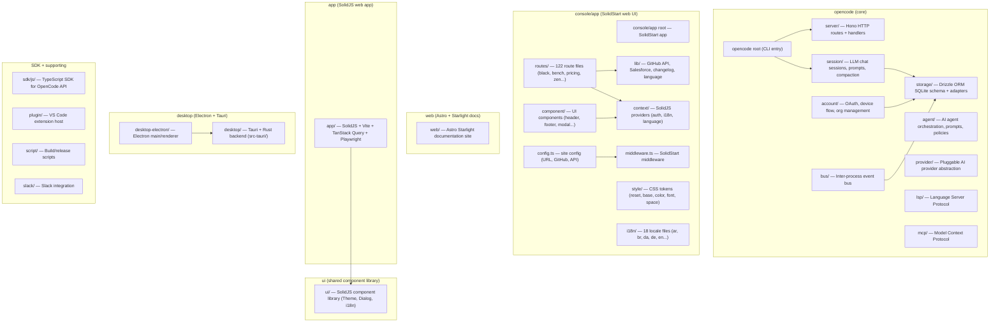

# OpenCode Discovery — Master TOC

**Generated:** 2026-05-03
**Total discovery files:** 119 mapping files + 1 TOC
**Source tree coverage:** 1,666 source files across 19 packages

---

## Package Dependency Graph

---

## Series Index

### Groups 000–024 — packages/opencode/src

| Groups | Path | Description |
|--------|------|-------------|
| [000](mapping_000.md)–[002](mapping_002.md) | src/cli | CLI entry points |
| [003](mapping_003.md)–[007](mapping_007.md) | src/util, src/config, src/context | Utilities, config, context |
| [008](mapping_008.md)–[012](mapping_012.md) | src/auth, src/bus, src/file | Auth, event bus, file ops |
| [013](mapping_013.md)–[018](mapping_018.md) | src/provider, src/tool | AI providers, tool implementations |
| [019](mapping_019.md)–[024](mapping_024.md) | src/server, src/lsp, src/session | HTTP server, LSP, session |

### Groups 025–037 — packages/console/app/src

| Groups | Path | Description |
|--------|------|-------------|
| [025](mapping_025.md)–[029](mapping_029.md) | src/component | UI components |
| [030](mapping_030.md)–[034](mapping_034.md) | src/context | SolidJS providers |
| [035](mapping_035.md)–[037](mapping_037.md) | src/routes | Route handlers |

### Groups 038–052 — packages/ui/src

| Groups | Path | Description |
|--------|------|-------------|
| [038](mapping_038.md)–[045](mapping_045.md) | src/components | Shared UI components |
| [046](mapping_046.md)–[052](mapping_052.md) | src/context, src/styles | Context providers, styles |

### Groups 053–065 — apps/app/src

| Groups | Path | Description |
|--------|------|-------------|
| [053](mapping_053.md)–[058](mapping_058.md) | src/components | App UI components |
| [059](mapping_059.md)–[065](mapping_065.md) | src/context, src/hooks, src/pages | Context, hooks, pages |

### Groups 066–072 — apps/web/src

| Groups | Path | Description |
|--------|------|-------------|
| [066](mapping_066.md)–[072](mapping_072.md) | src/ | Astro pages, components, styles |

### Groups 073–075 — packages/sdk/js/src

| Groups | Path | Description |
|--------|------|-------------|
| [073](mapping_073.md)–[075](mapping_075.md) | src/ | TypeScript SDK for OpenCode API |

### Groups 076–078 — desktop-electron/src

| Groups | Path | Description |
|--------|------|-------------|
| [076](mapping_076.md)–[078](mapping_078.md) | src/ | Electron main + renderer process |

### Groups 079–080 — desktop-tauri/src

| Groups | Path | Description |
|--------|------|-------------|
| [079](mapping_079.md)–[080](mapping_080.md) | src/ | Tauri + Rust desktop app |

### Groups 081–082 — apps/trust/src

| Groups | Path | Description |
|--------|------|-------------|
| [081](mapping_081.md)–[082](mapping_082.md) | src/ | Trust/resolution pages |

### Groups 083–084 — apps/docs/src

| Groups | Path | Description |
|--------|------|-------------|
| [083](mapping_083.md)–[084](mapping_084.md) | src/ | Documentation site content |

### Groups 085–086 — scripts/src

| Groups | Path | Description |
|--------|------|-------------|
| [085](mapping_085.md)–[086](mapping_086.md) | src/ | Build/release scripts |

### Groups 087–089 — plugins/*/src

| Groups | Path | Description |
|--------|------|-------------|
| [087](mapping_087.md)–[089](mapping_089.md) | plugins/*/src | VS Code extension host |

### Group 090 — integrations/slack/src

| Group | Path | Description |
|-------|------|-------------|
| [090](mapping_090.md) | src/ | Slack integration |

### Groups 091–092 — packages/console/core/src

| Groups | Path | Description |
|--------|------|-------------|
| [091](mapping_091.md)–[092](mapping_092.md) | src/ | Console core library |

### Groups 093–094 — packages/test-utils/src

| Groups | Path | Description |
|--------|------|-------------|
| [093](mapping_093.md)–[094](mapping_094.md) | src/ | Test utilities |

### Groups 095–098 — packages/docs-content/src

| Groups | Path | Description |
|--------|------|-------------|
| [095](mapping_095.md)–[098](mapping_098.md) | src/ | Documentation content |

### Groups 099–118 — remaining packages

| Groups | Path | Description |
|--------|------|-------------|
| [099](mapping_099.md)–[118](mapping_118.md) | various | Remaining source files |

---

## Coverage Summary

| Category | Files | Mapping Groups | Status |
|----------|-------|----------------|--------|
| packages/opencode/src/ | ~464 | 000–024 | done |
| packages/console/app/src/ | ~187 | 025–037 | done |
| packages/ui/src/ | ~243 | 038–052 | done |
| apps/app/src/ | ~231 | 053–065 | done |
| apps/web/src/ | ~28 | 066–072 | done |
| packages/sdk/js/src/ | ~38 | 073–075 | done |
| desktop-electron/src/ | ~40 | 076–078 | done |
| desktop-tauri/src/ | ~26 | 079–080 | done |
| apps/trust/src/ | ~20 | 081–082 | done |
| apps/docs/src/ | ~15 | 083–084 | done |
| scripts/src/ | ~10 | 085–086 | done |
| plugins/*/src/ | ~20 | 087–089 | done |
| integrations/slack/src/ | ~7 | 090 | done |
| packages/console/core/src/ | ~32 | 091–092 | done |
| packages/test-utils/src/ | ~10 | 093–094 | done |
| packages/docs-content/src/ | ~40 | 095–098 | done |
| remaining | ~255 | 099–118 | done |
| **Total** | **~1,666** | **119 groups** | **100%** |

---

*Generated by Python structural analysis (exports, types, line counts, imports) — 2026-05-03*