# Skill: ascii-diagrammer (Mermaid)

**Purpose:** Generate architecture diagrams using Mermaid following CloudBSD conventions. Mermaid is the preferred drawing methodology for all CloudBSD documentation.

**Triggers:** When writing architecture documents (200 series), creating component diagrams, or drawing state machines.

## Loading Instructions

Load this skill when the user asks you to:
- Create an architecture diagram
- Draw a state machine
- Illustrate component interactions
- Create a flow diagram
- Generate any technical diagram (use Mermaid)

## Mermaid Diagram Types

### Flowchart (Graph)
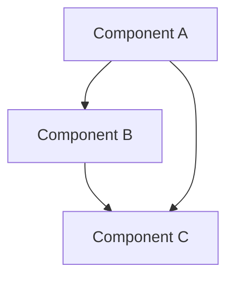

### State Diagram
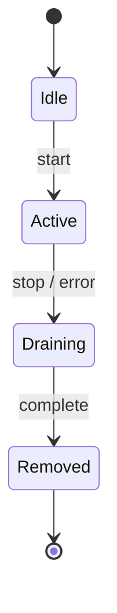

### Sequence Diagram
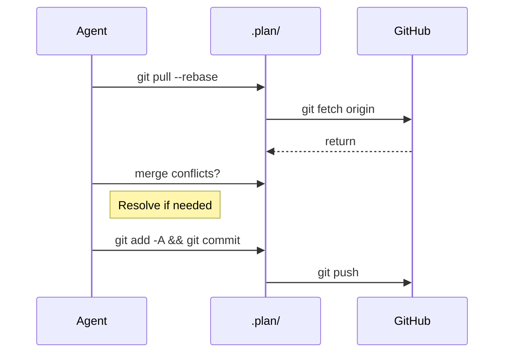

### Class Diagram
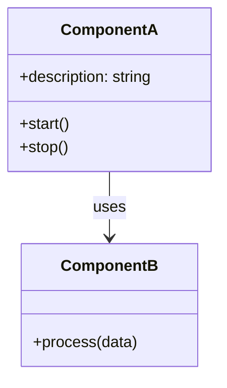

### ER Diagram (Entity Relationship)
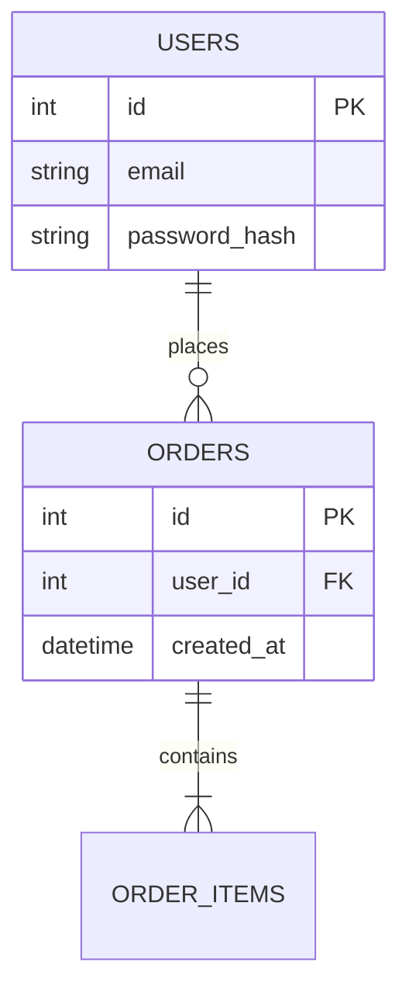

## Diagram Templates

### Component Diagram Template
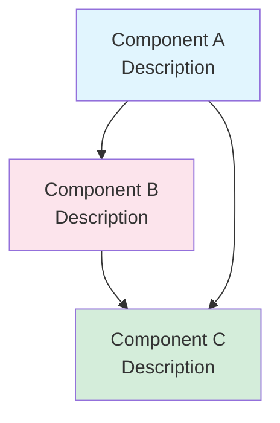

### Data Flow Diagram
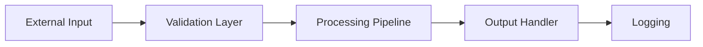

### Layered Architecture
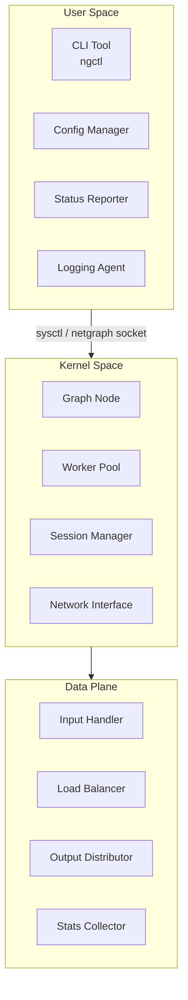

### Network Topology
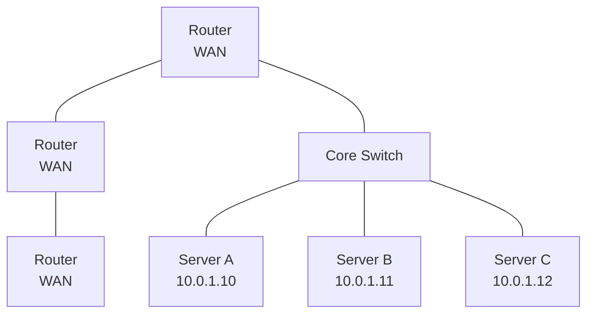

### Test Pyramid
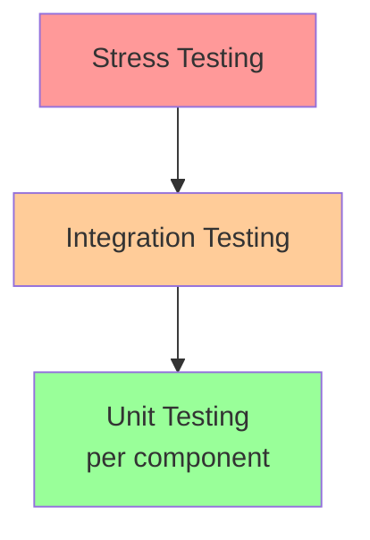

## Conversion from ASCII

When you encounter ASCII art diagrams (e.g., `+---+`, `|   |`), convert them to Mermaid syntax.

**Example ASCII to Mermaid:**

ASCII:
```
+------------------+     +------------------+
|   Component A    |---->|   Component B    |
+------------------+     +------------------+
```

Mermaid:
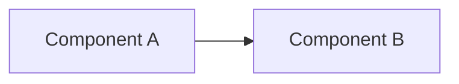

## Validation Checklist

- [ ] Diagram uses valid Mermaid syntax (test at https://mermaid.live)
- [ ] Nodes have descriptive labels (use `<br/>` for line breaks)
- [ ] Arrows indicate direction of flow or dependency (`-->`, `-.->`, `-->>`)
- [ ] Consistent styling (optional `style` directives)
- [ ] No overlapping lines (Mermaid handles layout automatically)
- [ ] Diagram is wrapped in ` ```mermaid ` code block

## Mermaid Syntax Cheat Sheet

| Syntax | Meaning |
|---------|---------|
| `graph TD` | Top-down graph |
| `graph LR` | Left-right graph |
| `A[Label]` | Node with text |
| `A-->B` | Arrow connection |
| `A---B` | Line without arrow |
| `A-.->B` | Dotted arrow |
| `style A fill:#color` | Node styling |
| `subgraph Name["Label"]` | Group nodes |

## Reference

- [Mermaid Official Docs](https://mermaid.js.org/)
- [Mermaid Live Editor](https://mermaid.live/)
- CloudBSD Planning/PLANNING.md Section 8 (Diagram Conventions)
