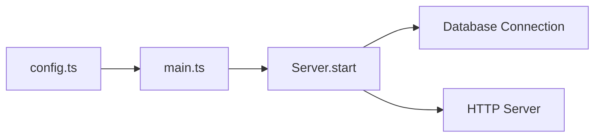
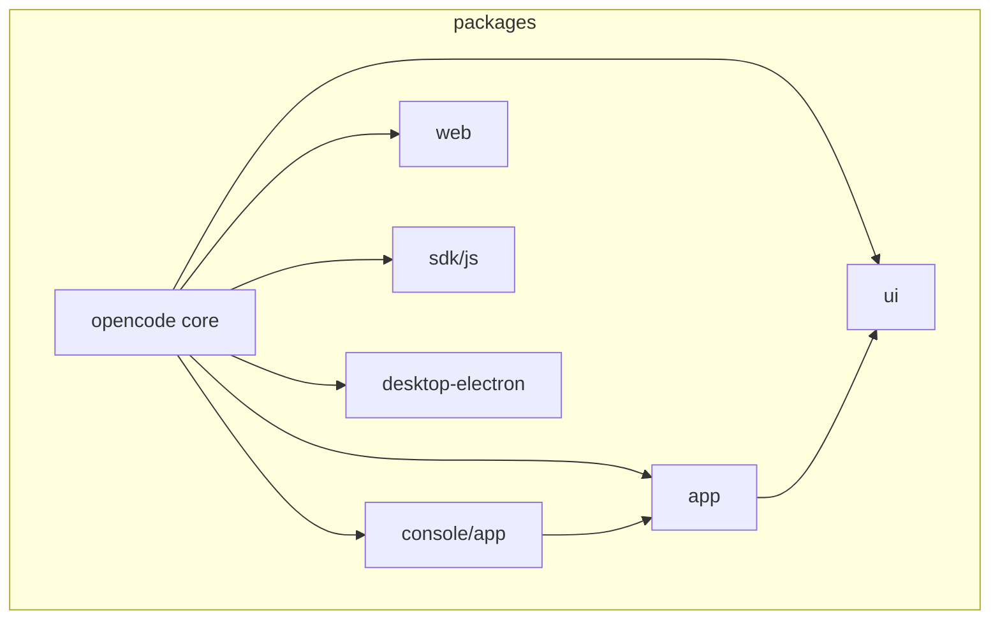
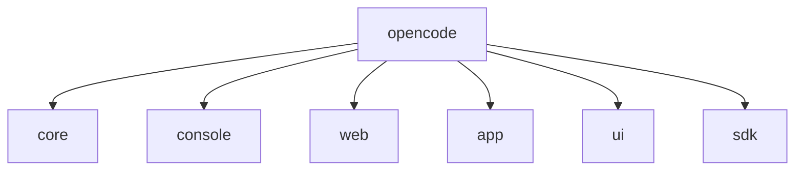
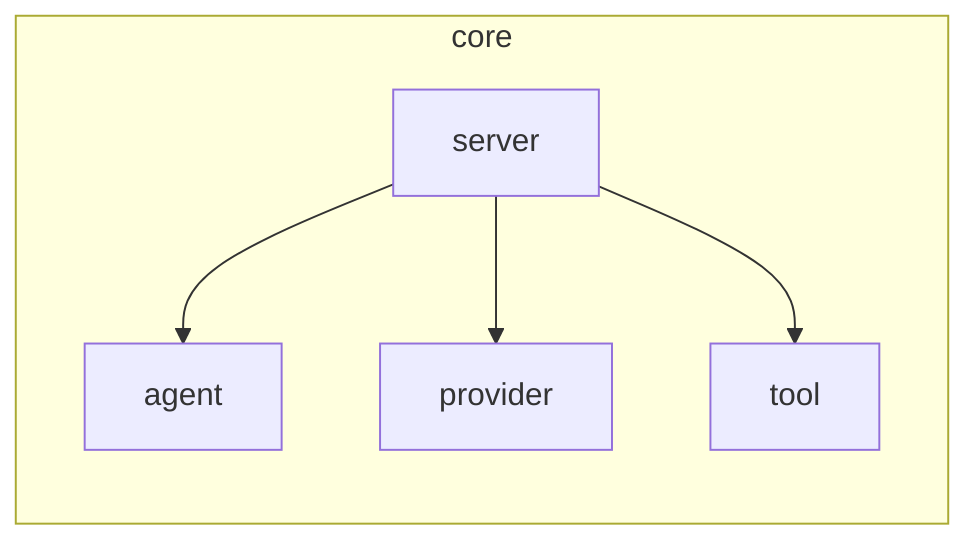

# Codebase Mapper

This skill performs exhaustive, recursive mapping of any codebase into tree-view markdown documents. Every component, file, function, and significant line of code gets its own mapped entry. The output lives in a `.discovery/` directory with a master TOC as the entry point.

**Version 2 — Key improvements:** Orphan Discovery phase, Coverage Verification gate, Mermaid diagrams, Monorepo detection, Enhanced dependency analysis, Language-agnostic parsing.

## Source Of Truth

The `.discovery/` directory is the single source of truth for codebase understanding. When mapping:

1. Always read the actual file contents before generating tree nodes.
2. Never assume what code does — verify by reading it.
3. If a file imports/requires other files, map those dependencies explicitly.
4. When encountering unfamiliar patterns, read surrounding context before classifying.
5. Prefer answers and descriptions backed by specific source content.

## Guidelines

- **Standards as Law**: This skill's methodology is mandatory, not optional. Every step must be followed.
- **UTF-8 Everywhere**: All generated markdown documents use UTF-8 encoding.
- **One File Per Component**: No single discovery file exceeds ~200 lines of tree content. If a component is large, split it into sub-files.
- **Recursion Has No Depth Limit**: Map as deep as needed. A single line of code can generate 10 tree levels if it involves imports, function calls, object construction, method chains, callbacks, and nested arguments.
- **No Duplication**: Each discovered item maps to exactly one file. Cross-reference via links, never duplicate content.
- **Evidence-Based Descriptions**: Every node description must be backed by what the code actually does, not what you think it should do.
- **Follow Existing Patterns**: When describing components, reference the actual patterns found in the codebase (conventions, naming, architecture).
- **Mermaid Diagrams**: Use Mermaid for all dependency graphs, data flow diagrams, and architecture diagrams. Use ASCII only when Mermaid is not expressive enough.
- **Do NOT modify source code**: This skill only reads and generates discovery documents. Never change the codebase being mapped.
- **Do NOT skip "obvious" items**: Even simple files get mapped. Assumptions about simplicity are the #1 cause of incomplete maps.

## Loading Instructions

Load this skill when the user asks you to:
- Map the codebase
- Create a codebase discovery document
- Generate a tree view of the project structure
- Document what every file and component does
- Create a `.discovery/` directory structure
- Build a codebase map with TOC
- Recursively explore and document the project
- Run coverage verification
- Find orphan files

## Core Directives (from CloudBSD Application Guidelines)

### Target Platform Awareness
- The codebase being mapped may target any platform. Document the target platform when identified.
- Do not assume the detected environment reflects the real target. Verify via `uname -s`, package managers, config files, and build scripts.

### Security Observations
- Flag hardcoded credentials, secrets, or security-relevant patterns.
- Document authentication flows, authorization checks, and input validation points.

### Configuration Patterns
- Document all configuration file formats and locations discovered.
- Map XDG Base Directory usage if present.

### Testing Infrastructure
- Map all test files, test frameworks, and CI/CD pipeline configurations.

## Mapping Phases

### Phase0: Entry Point Identification

Identify the starting point:

1. Read `package.json`, `Cargo.toml`, `go.mod`, `pyproject.toml`, `Makefile`, or equivalent.
2. Identify main executable, server entry, CLI entry, or library entry.
3. Read the entry point file completely before proceeding.
4. Create `.discovery/000-root.md`.

### Phase1: Directory Structure Scan

Generate a high-level tree:

```
project-root/
├── .discovery/          # Discovery documents (output)
├── src/
│   ├── main.ts          # Entry point → maps to 100-main.md
│   ├── config/          # Configuration module → maps to 200-config/
│   └── server/          # Server module → maps to 300-server/
├── test/
│   └── ...
└── ...
```

### Phase1.5: Orphan Discovery (CRITICAL)

Find ALL files not yet in discovery documents. This is the #1 reason mappings are incomplete.

**Step 1: Find ALL project files**

```bash
find . -type f \
  ! -path "./.discovery/*" \
  ! -path "./node_modules/*" \
  ! -path "./.git/*" \
  ! -path "./dist/*" \
  ! -path "./build/*" \
  ! -path "./.next/*" \
  ! -path "./__pycache__/*" \
  ! -name "*.min.js" \
  ! -name "*.bundle.js" \
  ! -name "*.map" \
  ! -name "*.pyc" \
  > /tmp/all_files.txt
```

**Step 2: Extract already-mapped files**

```bash
grep -h "**Path:**" .discovery/*.md 2>/dev/null | \
  sed 's/.*`//; s/`.*//' | sort -u > /tmp/mapped_files.txt
```

**Step 3: Find orphans**

```bash
comm -23 <(sort /tmp/all_files.txt) <(sort /tmp/mapped_files.txt) > /tmp/orphans.txt
```

**Orphan Categories:**

| Category | Priority | Action |
|----------|----------|--------|
| Entry points | 1 | Map immediately |
| Config files | 2 | Map with full content analysis |
| Core source | 3 | Map with full recursive analysis |
| Test files | 4 | Map with test framework identification |
| Build/CI tooling | 5 | Map build steps, triggers |
| Documentation | 6 | Map doc structure |
| Generated files | 7 | Skip with `[GENERATED]` note |
| Binary assets | 8 | Skip with `[BINARY]` note |
| IDE/Editor config | 9 | Note presence only |
| Type definitions | 10 | Map interfaces, augmentations |

**Orphan Mapping Pattern:**
```
For each orphan file:
  1. READ the file completely
  2. Categorize using table above
  3. Create new discovery doc with next available number
  4. Update TOC immediately
```

### Phase2: Recursive Component Mapping

#### File-Level Tree

```markdown
# Component: <filename>

**Path:** `relative/path/to/file.ext`
**Type:** File | Directory | Module | Service | Component
**Maps to:** `.discovery/<NNN>-<name>.md`
**Dependencies:** [list of imported files with links]
**Dependents:** [list of files that import this, with links]

## Structure

```
filename.ext
├── [import] "module-a" → .discovery/XXX-module-a.md
├── [import] "module-b" → .discovery/XXX-module-b.md
├── export function main() { ... }
│   ├── Initializes the application
│   ├── Loads configuration from config.ts
│   ├── Starts the HTTP server
│   └── Sets up error handlers
├── export class AppServer
│   ├── constructor(options: ServerOptions)
│   │   ├── Validates server options
│   │   ├── Creates Express/Koa/Hono instance
│   │   └── Registers middleware stack
│   ├── async start()
│   │   ├── Binds to configured port
│   │   ├── Logs startup message
│   │   └── Returns server instance
│   └── async stop()
│       ├── Closes database connections
│       ├── Stops background workers
│       └── Unbinds from port
└── [re-export] from "./utils" → .discovery/XXX-utils.md
```

## Description

<What this file/component does, in 2-3 sentences based on actual code content.>

## Data Flow

<Data flow using Mermaid>



## Side Effects

<Any I/O, network calls, file writes, process spawning, or external system interactions.>
```

### Phase1.75: Monorepo Detection

Detect monorepo structure:

```bash
[ -f "lerna.json" ] && echo "Lerna monorepo"
[ -f "nx.json" ] && echo "Nx monorepo"
[ -f "turbo.json" ] && echo "Turborepo"
grep -q '"workspaces"' package.json && echo "npm/yarn workspaces"
find . -name "package.json" ! -path "*/node_modules/*" | sort
```

**Monorepo Structure:**

```
.discovery/
├── root/               # Root-level analysis
├── packages/
│   ├── pkg-a/          # Package A discovery
│   └── pkg-b/          # Package B discovery
└── TOC.md             # Master TOC linking all packages
```

### Phase2.5: Enhanced Dependency Analysis

**Package Manager Dependencies:**

```bash
for pkg in $(find . -name "package.json" ! -path "*/node_modules/*"); do
  echo "=== $pkg ==="
  jq -r '.dependencies, .devDependencies, .peerDependencies | keys[]' "$pkg" 2>/dev/null
done | sort -u
```

**Dependency Graph (Mermaid):**



### Phase3: Cross-Reference Generation

Track every import/require, build dependency graph, identify:
- Circular dependencies
- Orphan files (not imported by anything)
- Entry points (nothing imports them)

### Phase4: Coverage Verification (MANDATORY)

**BEFORE generating TOC, verify 100%:**

```bash
find . -type f ! -path "./.discovery/*" ! -path "./node_modules/*" \
  ! -path "./.git/*" | sort > /tmp/verify_all.txt

grep -h "**Path:**" .discovery/*.md 2>/dev/null | \
  sed 's/.*`//; s/`.*//' | sort -u > /tmp/verify_mapped.txt

comm -23 /tmp/verify_all.txt /tmp/verify_mapped.txt > /tmp/still_orphans.txt

if [ -s /tmp/still_orphans.txt ]; then
  echo "ERROR: Still have unmapped files!"
  cat /tmp/still_orphans.txt
  exit 1
fi
echo "Coverage: 100%"
```

**Quality Gates:**

| Gate | Check | Failure Action |
|------|-------|----------------|
| Count Match | all_files - mapped_files = 0 | Map remaining orphans |
| Import Links | Every import has linked .discovery/ file | Create missing docs |
| Export Docs | Every export documented | Add missing descriptions |
| TOC Links | TOC links to every document | Add missing entries |
| No Duplicates | No discovery file > 200 lines unsplit | Split large files |
| Mermaid | All diagrams use Mermaid (not ASCII) | Convert ASCII to Mermaid |

### Phase5: TOC Generation

Create `.discovery/TOC.md` with Mermaid:

```markdown
# Codebase Discovery — Table of Contents

**Project:** <name>
**Generated:** YYYY-MM-DD
**Coverage:** 100% ✅

## Project Structure



## Document Map

| File | Component | Type | Description |
|------|-----------|------|-------------|
| [000-root.md](./000-root.md) | Root | Entry | Project root |
| ... | ... | ... | ... |

## Dependency Graph (Mermaid)



## Statistics

| Metric | Count |
|--------|-------|
| Total files mapped | |
| Total discovery documents | |
| Orphan files found | |
| Circular dependencies | |

## Coverage Verification

- [x] 100% file coverage verified
- [x] All imports linked
- [x] Mermaid diagrams used
- [x] TOC links to all documents
```

## Naming Convention

| Pattern | Example |
|---------|---------|
| Root entry | `.discovery/000-root.md` |
| Single file | `.discovery/100-main.md` |
| Directory group | `.discovery/200-config/` |
| Sub-component | `.discovery/201-config-schema.md` |
| Orphan file | `.discovery/950-<name>.md` |

## Tree Node Format

```
├── [type] identifier
│   ├── <description of what it does>
│   └── <output or return value>
```

Types: `[import]`, `[export]`, `[function]`, `[class]`, `[const]`, `[type]`, `[enum]`, `[route]`, `[handler]`, `[middleware]`, `[hook]`, `[method]`, `[re-export]`, `[side-effect]`, `[generated]`, `[binary]`

## Language-Agnostic Node Types

| Language | Import | Export | Key Patterns |
|----------|--------|--------|--------------|
| TypeScript/JS | `[import]` | `[export]` | `[re-export]`, `[route]`, `[handler]` |
| Python | `[import-py]` | `[def]`, `[class-py]` | `[decorator]` |
| Rust | `[use]` | `[pub-fn]`, `[struct]` | `[trait]`, `[impl]` |
| Go | `[import-go]` | `[func]`, `[type-go]` | `[goroutine]` |
| CSS | `[import-css]` | `[rule]` | `[selector]`, `[mixin]` |

## Splitting Rules

Split when:
1. Tree exceeds 200 lines
2. Component has 10+ child nodes
3. Class has 5+ methods
4. Description section exceeds 50 lines

## Quality Checklist

- [ ] 100% file coverage (verified)
- [ ] Every import has a linked discovery document
- [ ] Every export is documented
- [ ] Directory trees show all children
- [ ] TOC links to every discovery document
- [ ] Dependency graph is accurate (Mermaid)
- [ ] All circular dependencies identified
- [ ] Orphan files listed AND mapped
- [ ] Entry points identified
- [ ] No file exceeds 200 lines unsplit
- [ ] All descriptions evidence-based
- [ ] Mermaid used for all diagrams
- [ ] UTF-8 encoding throughout

## Reference

- CloudBSD Application Guidelines: `https://github.com/cloudbsdorg/application_guidelines`
- Planning/PLANNING.md for TOC conventions
- ascii-diagrammer skill for diagram patterns
- toc-generator skill for TOC patterns
