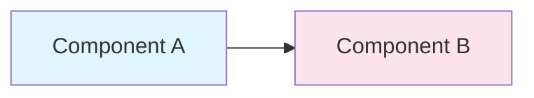

# Skill: plan-document-generator

**Purpose:** Create new plan documents following the CloudBSD Planning Guidelines standard template.

**Triggers:** When starting a new project, adding a new document to an existing project, or creating the .plan/ directory structure.

## Loading Instructions

Load this skill when the user asks you to:
- Create a new .plan/ directory structure
- Create a new plan document (e.g., "create the 700 risks document")
- Initialize planning for a new project
- Add a new document type to an existing project

## Pre-Planning: Analysis Phase

**IMPORTANT:** Before generating any plan documents, run the analysis workflow to understand the actual codebase:

1. **Load source-analysis-orchestrator** to coordinate analysis
2. **Generate Feature Inventory** to know what exists
3. **Generate Refactoring Backlog** to plan improvements

Do NOT generate implementation tasks without first analyzing the source code. Plans should reflect reality, not assumptions.

### Analysis → Planning Workflow

```
Source Code
    │
    ▼
source-analysis-orchestrator
    │
    ├──► Feature Inventory (what actually exists)
    │
    ├──► Component Map (roles classified)
    │
    ├──► Portability Report (OS-specific items)
    │
    └──► Refactoring Backlog (duplication, interfaces)
            │
            ▼
    feature-task-generator
            │
            ▼
    plan-document-generator (informed by analysis)
```

## Document Type Templates

### TOC Document (000)

```markdown
# <Project> Planning — Table of Contents

**Document ID:** <Project>-TOC
**Version:** 1.0
**Last Updated:** YYYY-MM-DD
**Maintainer:** <Team or Contact>
**Status:** ACTIVE
**Classification:** INTERNAL

---

## Document Map

| File | Title | Status | Description |
|------|-------|--------|-------------|
| `000-<Project>-TOC.md` | Table of Contents | ACTIVE | This document |
| `001-<Project>-Workflow.md` | Workflow | DRAFT | Task claiming and completion |
| ... | ... | ... | ... |

## Dependency Graph

```
000 (TOC) ──┬── 001 (Workflow)
            └── 100 (Overview) ──┬── 200 (Architecture)
                                  ├── 300 (Implementation)
                                  └── 400 (Testing)
```

## Recommended Reading Order

1. `000-<Project>-TOC.md` (this file)
2. `001-<Project>-Workflow.md`
3. `100-<Project>-Overview.md`
4. `200-<Project>-Architecture-Design.md`
5. `300-<Project>-Implementation-Tasks.md`
6. `400-<Project>-Testing.md`

## Cross-Reference Index

| Topic | Documents |
|-------|-----------|
| Security | `101-<Project>-Security-*.md` |
| Sysctls | `501-<Project>-Sysctl-Interface.md` |

---

## Change Log

| Version | Date | Author | Changes |
|---------|------|--------|---------|
| 1.0 | YYYY-MM-DD | Name | Initial version |

**Last Updated:** YYYY-MM-DD HH:MM UTC
**Classification:** INTERNAL
```

### Workflow Document (001)

```markdown
# <Project> Planning — Workflow

**Document ID:** <Project>-Workflow
**Version:** 1.0
**Last Updated:** YYYY-MM-DD
**Maintainer:** <Team or Contact>
**Status:** ACTIVE
**Classification:** INTERNAL

---

## Task Claiming Protocol

1. Verify all dependencies are ✅ DONE
2. Set Status to 🔄 IN PROGRESS
3. Set Assigned To to your hostname
4. Set Start to current UTC timestamp
5. Commit and push immediately

## Task Completion Protocol

1. Implement the task and verify tests pass
2. Set Status to ✅ DONE
3. Set End to current UTC timestamp
4. Update Notes with summary
5. Commit and push immediately

## Merge Conflict Resolution

1. Check if your task was taken by another agent
2. If taken, abandon and pick a different task
3. If not taken, resolve conflict keeping both changes
4. git add <file> && git rebase --continue && git push

---

## Change Log

| Version | Date | Author | Changes |
|---------|------|--------|---------|
| 1.0 | YYYY-MM-DD | Name | Initial version |

**Last Updated:** YYYY-MM-DD HH:MM UTC
**Classification:** INTERNAL
```

### Overview Document (100)

```markdown
# <Project> Planning — Overview

**Document ID:** <Project>-Overview
**Version:** 1.0
**Last Updated:** YYYY-MM-DD
**Maintainer:** <Team or Contact>
**Status:** ACTIVE
**Classification:** INTERNAL

---

## Executive Summary

<Brief description of what this project builds and why>

## Problem Statement

<What problem does this solve?>

## High-Level Architecture



## Implementation Phases

| Phase | Focus | Description |
|-------|-------|-------------|
| Phase 1 | Kernel | Core implementation |
| Phase 2 | Userland | Userland tools |
| Phase 3 | Integration | Full system |

## Success Criteria

- <Criterion 1>
- <Criterion 2>

---

## Change Log

| Version | Date | Author | Changes |
|---------|------|--------|---------|
| 1.0 | YYYY-MM-DD | Name | Initial version |

**Last Updated:** YYYY-MM-DD HH:MM UTC
**Classification:** INTERNAL
```

### Risks Document (700)

```markdown
# <Project> Planning — Risks

**Document ID:** <Project>-Risks
**Version:** 1.0
**Last Updated:** YYYY-MM-DD
**Maintainer:** <Team or Contact>
**Status:** ACTIVE
**Classification:** INTERNAL

---

## Risk Register

| Risk ID | Description | Probability | Impact | Mitigation | Status |
|---------|-------------|-------------|--------|------------|--------|
| R001 | <Risk description> | Low/Medium/High | Low/Medium/High | <Mitigation strategy> | OPEN |

## Risk Categories

- **Technical**: Code, architecture, integration risks
- **Schedule**: Timeline, resource risks
- **External**: Dependencies, market risks

## High-Priority Risks

### R001: <Title>
- **Probability**: <Low/Medium/High>
- **Impact**: <Low/Medium/High>
- **Mitigation**: <Strategy>
- **Contingency**: <Backup plan>

---

## Change Log

| Version | Date | Author | Changes |
|---------|------|--------|---------|
| 1.0 | YYYY-MM-DD | Name | Initial version |

**Last Updated:** YYYY-MM-DD HH:MM UTC
**Classification:** INTERNAL
```

### Implementation Tasks Document (300)

```markdown
# <Project> Planning — Implementation Tasks

**Document ID:** <Project>-Implementation
**Version:** 1.0
**Last Updated:** YYYY-MM-DD
**Maintainer:** <Team or Contact>
**Status:** ACTIVE
**Classification:** INTERNAL

---

## Phase 1: Kernel

## Phase 2: Userland

## Phase 3: Integration

---

## Detailed Specifications

### 300.1 <Task Title> {#3001}

**Detailed Specification:**
- <Requirement 1>
- <Requirement 2>

**Acceptance Criteria:**
- [ ] <Criterion 1>
- [ ] <Criterion 2>

**Test Steps:**
1. <Step 1>
2. <Step 2>

---

## Change Log

| Version | Date | Author | Changes |
|---------|------|--------|---------|
| 1.0 | YYYY-MM-DD | Name | Initial version |

**Last Updated:** YYYY-MM-DD HH:MM UTC
**Classification:** INTERNAL
```

### Task Table Format

When creating task tables in implementation documents, use this format:

```markdown
| ID | Task | Priority | Status | Assigned To | Owner | Phase | Start | End | Dependencies | Files | Spec | Notes |
|----|------|----------|--------|-------------|-------|-------|-------|-----|--------------|-------|------|-------|
| 300.1 | Create module entry point | P0 | ⬜ PENDING | | | Phase 1 | | | | `sys/foo/foo_mod.c` | [Spec](#3001) | |
```

**Note:** The `Spec` column links to the detailed specification section (e.g., `[Spec](#3001)`) which should be defined in the `Detailed Specifications` section of the same document using the anchor pattern `{#3001}`.

## Naming Convention

Documents follow: `<Number>-<Project>-<Topic>.md`

| Category | Numbers | Example |
|----------|---------|---------|
| Meta | 0xx | `000-MyProject-TOC.md` |
| Overview | 1xx | `100-MyProject-Overview.md` |
| Architecture | 2xx | `200-MyProject-Architecture.md` |
| Implementation | 3xx | `300-MyProject-Tasks.md` |
| Testing | 4xx | `400-MyProject-Testing.md` |
| Governance | 5xx | `500-MyProject-Governance.md` |
| Alternatives | 6xx | `600-MyProject-Alternatives.md` |
| Risks | 7xx | `700-MyProject-Risks.md` |
| Future | 8xx | `800-MyProject-Future.md` |
| Validation | 9xx | `900-MyProject-Validation.md` |

## Document Header Block

Every document must start with:

```markdown
**Document ID:** <Unique-ID>
**Version:** <Version-Number>
**Last Updated:** <YYYY-MM-DD>
**Maintainer:** <Team or Contact>
**Status:** DRAFT | ACTIVE | STALE | DEPRECATED
**Classification:** INTERNAL | CONFIDENTIAL | PUBLIC
```

## Document Footer Block

Every document must end with:

```markdown
---

## Change Log

| Version | Date | Author | Changes |
|---------|------|--------|---------|
| 1.0 | YYYY-MM-DD | Name | Initial version |

**Last Updated:** YYYY-MM-DD HH:MM UTC
**Contact:** maintainer@example.com
**Classification:** INTERNAL
```

## Reference

See Planning/PLANNING.md Section 2 (Document Naming Convention) and Section 3 (Document Structure) for full specifications.