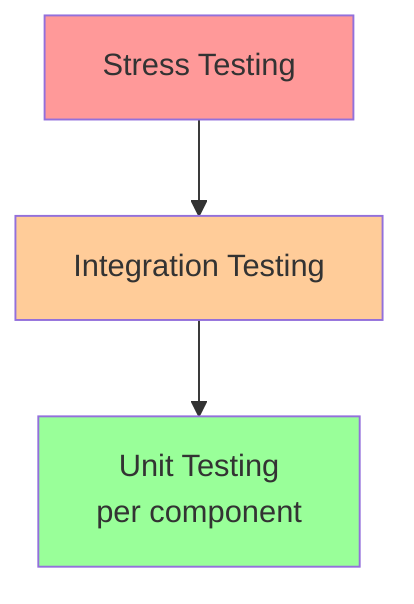
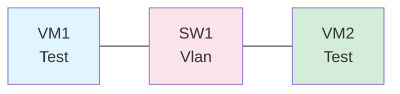

# Skill: test-planner

**Purpose:** Generate testing documentation including test case matrices, test plans, and testing scope documents.

**Triggers:** When creating 401, 402, 1101 documents, or when planning test coverage.

## Loading Instructions

Load this skill when the user asks you to:
- Create a test plan
- Generate test cases
- Document test coverage
- Create testing scope document
- Plan unit/integration testing

## Test Case Matrix Format

```markdown
## Test Case Matrix

| TC-ID | Category | Description | Priority | Status | Requirements |
|-------|----------|-------------|----------|--------|-------------|
| TC-001 | Unit | Test module initialization | P0 | ✅ DONE | REQ-001 |
| TC-002 | Unit | Test configuration parsing | P0 | 🔄 IN PROGRESS | REQ-002 |
| TC-003 | Integration | Test component communication | P1 | ⬜ PENDING | REQ-003 |
```

## Test Case Template

```markdown
### TC-<Id>: <Test Case Name>

**Type:** Unit | Integration | System | Stress
**Priority:** P0 | P1 | P2 | P3
**Status:** ⬜ PENDING | 🔄 IN PROGRESS | ✅ DONE

**Requirements:** REQ-<Id>

**Preconditions:**
- <Condition 1>
- <Condition 2>

**Test Steps:**
1. <Step 1>
2. <Step 2>
3. <Step 3>

**Expected Result:**
<What should happen>

**Postconditions:**
- <Cleanup or state verification>

**Dependencies:**
- TC-<Id> (must complete first)
```

## Test Pyramid



## Unit Testing Document Structure (401)

```markdown
# <Project> Planning — Unit Tests

**Document ID:** <Project>-UnitTests
**Version:** 1.0
**Last Updated:** YYYY-MM-DD
**Maintainer:** <Team>
**Status:** ACTIVE

---

## Testing Scope

### Core Logic Identification

| Module | File | Coverage Target |
|--------|------|-----------------|
| Worker Pool | `sys/kern/worker_pool.c` | 90% |
| Session Manager | `sys/kern/session_mgr.c` | 85% |

### Boundary Analysis

| Edge Case | Test Case | Validation |
|-----------|-----------|-----------|
| Maximum connections | TC-010 | Verify graceful rejection |
| Null pointer input | TC-011 | Verify NULL check |
| Integer overflow | TC-012 | Verify overflow handling |

## Mocking Strategy

### Kernel Hooks

```c
/* Mock for testing */
static int (*real_if_input)(struct ifnet *, struct mbuf *);
static int mock_if_input(struct ifnet *, struct mbuf *);

#define if_input mock_if_input
```

### Network Sockets

<Protocol for mocking sockets>

## Validation Metrics

| Metric | Target |
|--------|--------|
| Line coverage | 85% |
| Branch coverage | 80% |
| Critical path | 100% |

## Test Environment

- **Runner:** Kyua (FreeBSD), atf-sh
- **Framework:** Google Test (userland)
- **Location:** `tests/` directory

---

## Change Log

| Version | Date | Author | Changes |
|---------|------|--------|---------|
| 1.0 | YYYY-MM-DD | Name | Initial version |

**Last Updated:** YYYY-MM-DD HH:MM UTC
**Classification:** INTERNAL
```

## Integration Testing Document Structure (402)

```markdown
# <Project> Planning — Integration Tests

**Document ID:** <Project>-IntegrationTests
**Version:** 1.0
**Last Updated:** YYYY-MM-DD
**Maintainer:** <Team>
**Status:** ACTIVE

---

## End-to-End Scenarios

### Full Lifecycle Tests

| Scenario | Test Case | Duration |
|----------|-----------|----------|
| Startup to shutdown | TC-E2E-001 | ~30s |
| Graceful restart | TC-E2E-002 | ~45s |
| Crash recovery | TC-E2E-003 | ~60s |

## Performance Testing

| Metric | Target | Test Case |
|--------|--------|-----------|
| Max concurrent sessions | 10,000 | TC-PERF-001 |
| Latency p99 | <10ms | TC-PERF-002 |
| Throughput | 100 Gbps | TC-PERF-003 |

## Network Topology



---

## Change Log

| Version | Date | Author | Changes |
|---------|------|--------|---------|
| 1.0 | YYYY-MM-DD | Name | Initial version |

**Last Updated:** YYYY-MM-DD HH:MM UTC
**Classification:** INTERNAL
```

## Testing Scope Document Structure (1101)

```markdown
# <Project> Planning — Testing Scope

**Document ID:** <Project>-TestingScope
**Version:** 1.0
**Last Updated:** YYYY-MM-DD
**Maintainer:** <Team>
**Status:** ACTIVE

---

## Test Case Inventory

### Happy Path Tests

| TC-ID | Description | Component | Priority |
|-------|-------------|-----------|----------|
| TC-001 | Normal initialization | Core | P0 |
| TC-002 | Standard operation | Worker | P0 |

### Error Path Tests

| TC-ID | Description | Component | Priority |
|-------|-------------|-----------|----------|
| TC-101 | Handle out-of-memory | Core | P0 |
| TC-102 | Handle network failure | Network | P1 |

## Requirements Traceability Matrix

| Requirement | Test Cases | Coverage |
|-------------|------------|----------|
| REQ-001: Initialization | TC-001, TC-002 | 100% |
| REQ-002: Configuration | TC-010-TC-019 | 90% |
| REQ-003: Data handling | TC-020-TC-030 | 85% |

---

## Change Log

| Version | Date | Author | Changes |
|---------|------|--------|---------|
| 1.0 | YYYY-MM-DD | Name | Initial version |

**Last Updated:** YYYY-MM-DD HH:MM UTC
**Classification:** INTERNAL
```

## Test Priority Classification

| Priority | Meaning | Automation Target |
|----------|---------|-------------------|
| P0 | Critical path, must pass | 100% automated |
| P1 | Important, should pass | 90% automated |
| P2 | Standard tests | 70% automated |
| P3 | Nice to have | Manual acceptable |

## Coverage Requirements

| Component Type | Line Coverage | Branch Coverage |
|----------------|--------------|----------------|
| Core logic | 90% | 85% |
| Error handlers | 80% | 75% |
| Utilities | 70% | 65% |
| UI/CLI | 60% | 50% |

## Reference

See Planning/PLANNING.md Section 3.15 (Testing and Validation) for full specifications.