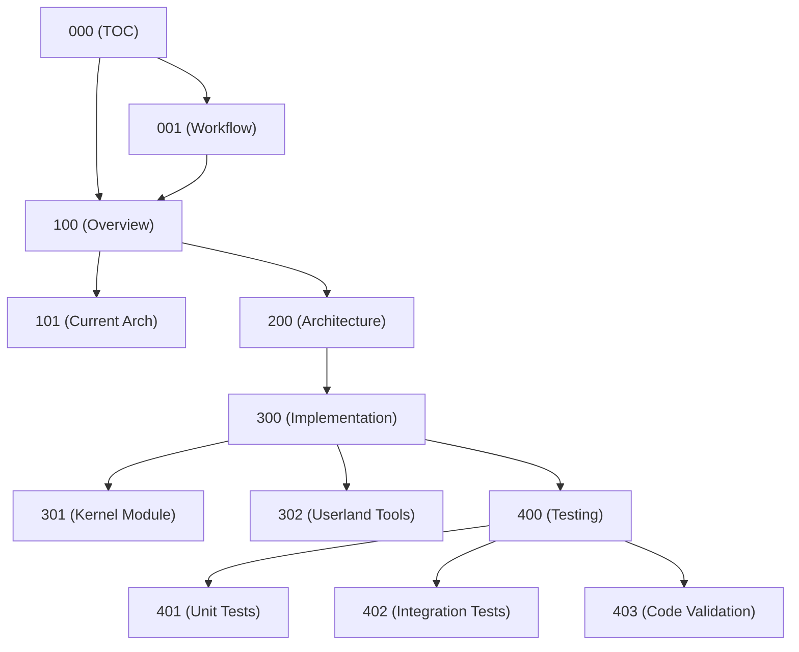

# Skill: toc-generator

**Purpose:** Create and maintain Table of Contents documents for project planning.

**Triggers:** When creating the 000 document, or when documents are added/removed from a project.

## Loading Instructions

Load this skill when the user asks you to:
- Create a TOC document
- Update the TOC after adding documents
- Generate a document map
- Create a dependency graph

## Required TOC Sections

1. **Document Map** — Table of all plan documents
2. **Dependency Graph** — Relationships between documents
3. **Recommended Reading Order** — For new contributors
4. **Cross-Reference Index** — Topics spanning multiple documents

## Document Map Table Format

```markdown
| File | Title | Status | Description |
|------|-------|--------|-------------|
| `000-<Project>-TOC.md` | Table of Contents | ACTIVE | This document |
| `001-<Project>-Workflow.md` | Workflow | ACTIVE | Task claiming and completion |
| `100-<Project>-Overview.md` | Overview | ACTIVE | High-level architecture |
| `101-<Project>-Current-Architecture.md` | Current Architecture | DRAFT | Analysis of existing system |
| ... | ... | ... | ... |
```

### Status Values for Documents

| Status | Meaning |
|--------|---------|
| ACTIVE | Current, up-to-date |
| DRAFT | In development |
| STALE | Outdated, needs review |
| DEPRECATED | Superseded by another document |

## Dependency Graph Format

Use Mermaid to show document relationships:

```markdown
## Dependency Graph


```

## Recommended Reading Order

```markdown
## Recommended Reading Order

For new contributors, read documents in this order:

1. `000-<Project>-TOC.md` — This document (overview of all docs)
2. `001-<Project>-Workflow.md` — How to work on tasks
3. `100-<Project>-Overview.md` — The big picture
4. `101-<Project>-Current-Architecture.md` — Current state analysis
5. `200-<Project>-Architecture-Design.md` — Solution design
6. `300-<Project>-Implementation-Tasks.md` — Implementation roadmap
7. `700-<Project>-Risks.md` — Known risks and mitigations
8. `400-<Project>-Testing.md` — Testing strategy
```

## Cross-Reference Index

```markdown
## Cross-Reference Index

| Topic | Relevant Documents |
|-------|-------------------|
| Security | `1.1-Emulation-Security-p1-ThreatModel-Isolation.md`, `403-<Project>-Code-Validation.md` |
| Sysctls | `501-<Project>-Sysctl-Interface.md`, `100-<Project>-Overview.md` |
| Testing | `400-<Project>-Testing.md`, `401-<Project>-Unit-Tests.md`, `402-<Project>-Integration-Tests.md` |
| Kernel | `301-<Project>-Kernel-Module.md`, `100-<Project>-Overview.md` |
```

## Quick Links Section

```markdown
## Quick Links

| Category | Link |
|----------|------|
| Build Status | [0002-<Project>-Build-Status.md](./0002-<Project>-Build-Status.md) |
| Current Tasks | [300-<Project>-Implementation-Tasks.md](./300-<Project>-Implementation-Tasks.md) |
| Validation Report | [900-<Project>-Validation.md](./900-<Project>-Validation.md) |
```

## Document Metadata Table

```markdown
## Document Metadata

| Document | Version | Last Updated | Maintainer |
|----------|---------|--------------|------------|
| 000-TOC | 1.0 | 2026-05-02 | Architecture Team |
| 001-Workflow | 1.2 | 2026-04-15 | Architecture Team |
| 100-Overview | 2.0 | 2026-05-01 | Architecture Team |
```

## Build Status Integration

```markdown
## Build Status Summary

| Component | Build | Unit Tests | Integration Tests |
|-----------|-------|------------|-------------------|
| Kernel Module | ✅ PASS | ✅ PASS | 🔄 IN PROGRESS |
| Userland Tools | ✅ PASS | ⏳ PENDING | ⏳ PENDING |

[Full build status](./0002-<Project>-Build-Status.md)
```

## Template for 000 Document

```markdown
# <Project> Planning — Table of Contents

**Document ID:** <Project>-TOC
**Version:** 1.0
**Last Updated:** YYYY-MM-DD
**Maintainer:** <Team>
**Status:** ACTIVE
**Classification:** INTERNAL

---

## Document Map

| File | Title | Status | Description |
|------|-------|--------|-------------|
| ... | ... | ... | ... |

## Dependency Graph

```
<dependency graph>
```

## Recommended Reading Order

1. ...
2. ...

## Cross-Reference Index

| Topic | Documents |
|-------|-----------|

## Quick Links

| Category | Link |
|----------|------|

## Build Status Summary

| Component | Status |
|-----------|--------|
| ... | ... |

---

## Change Log

| Version | Date | Author | Changes |
|---------|------|--------|---------|
| 1.0 | YYYY-MM-DD | Name | Initial version |

**Last Updated:** YYYY-MM-DD HH:MM UTC
**Classification:** INTERNAL
```

## Validation Checklist

- [ ] All documents in .plan/ are listed
- [ ] No duplicate documents
- [ ] Status values are valid
- [ ] Dependency graph accurately reflects relationships
- [ ] Reading order is logical for new contributors
- [ ] Cross-references are accurate
- [ ] Links are correct (verify file paths)
- [ ] Change log is updated

## Reference

See Planning/PLANNING.md Section 3.1 (Table of Contents) for full specification.